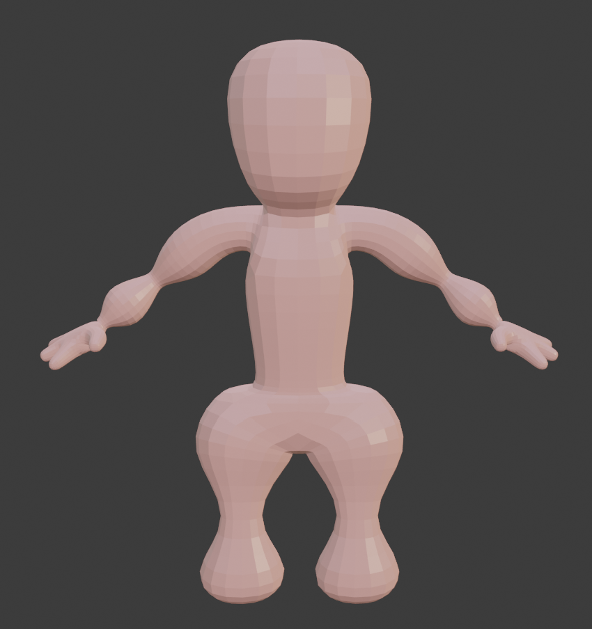
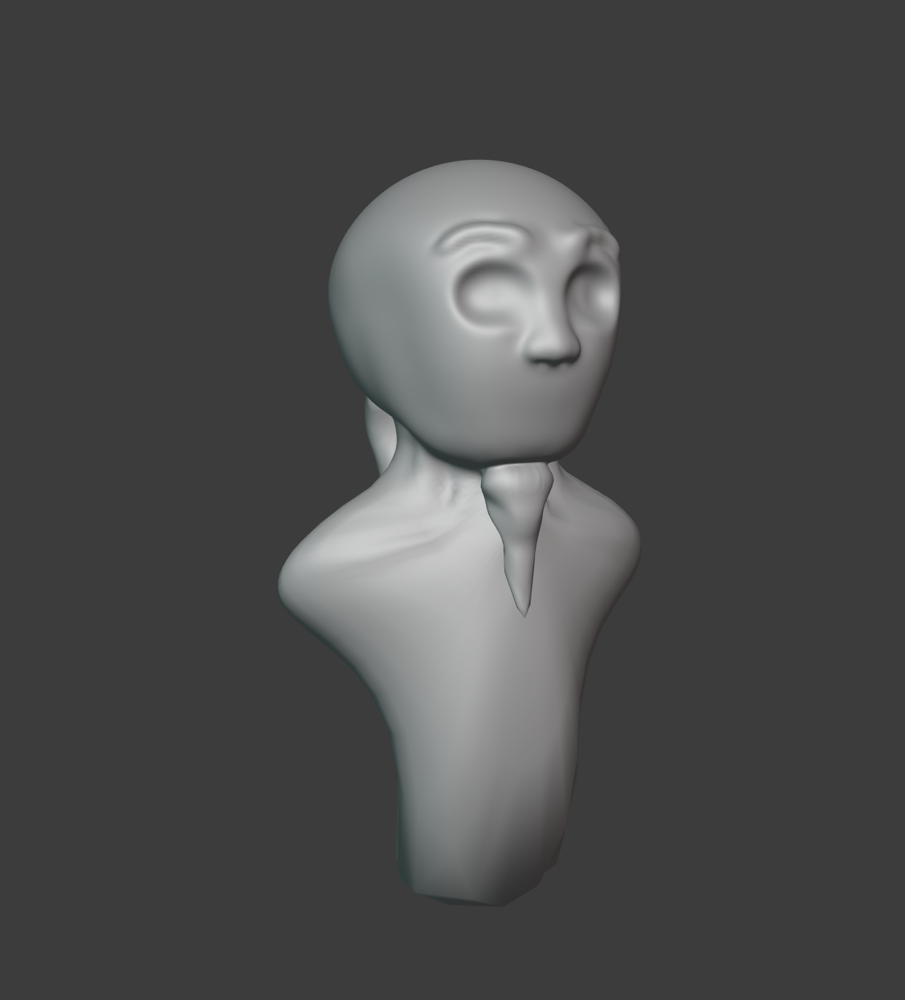
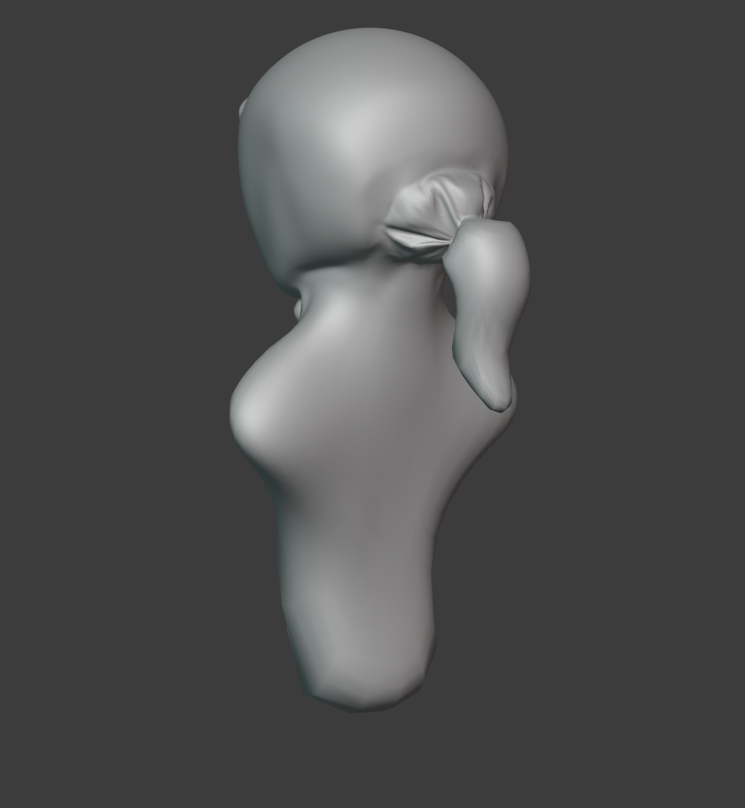
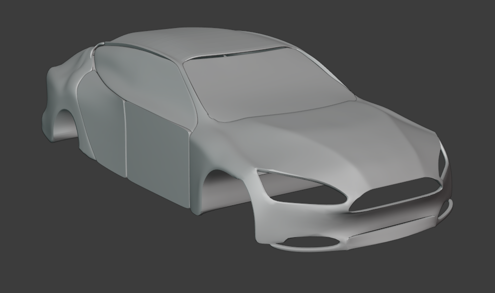
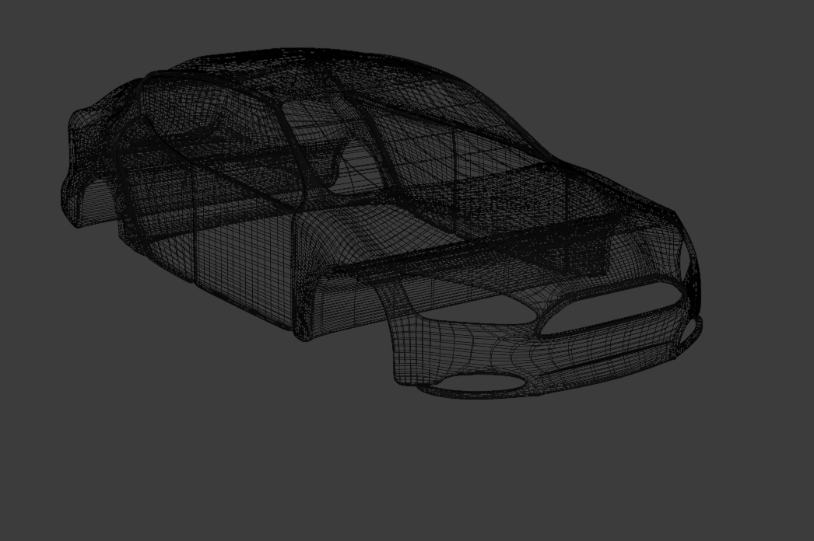
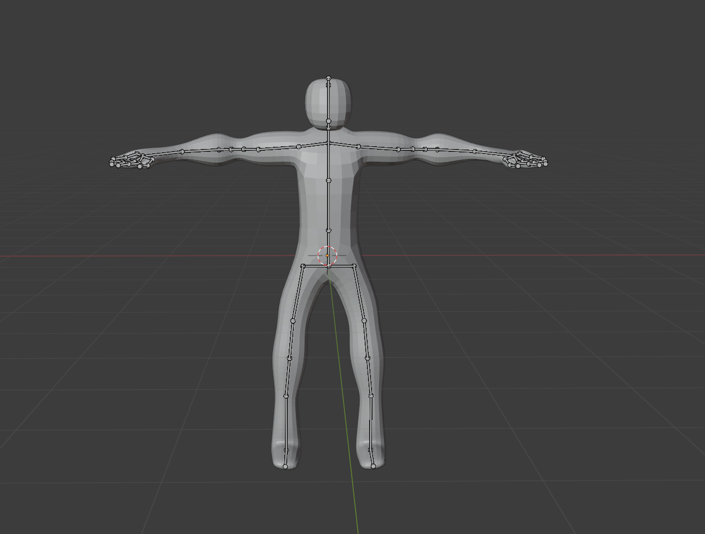
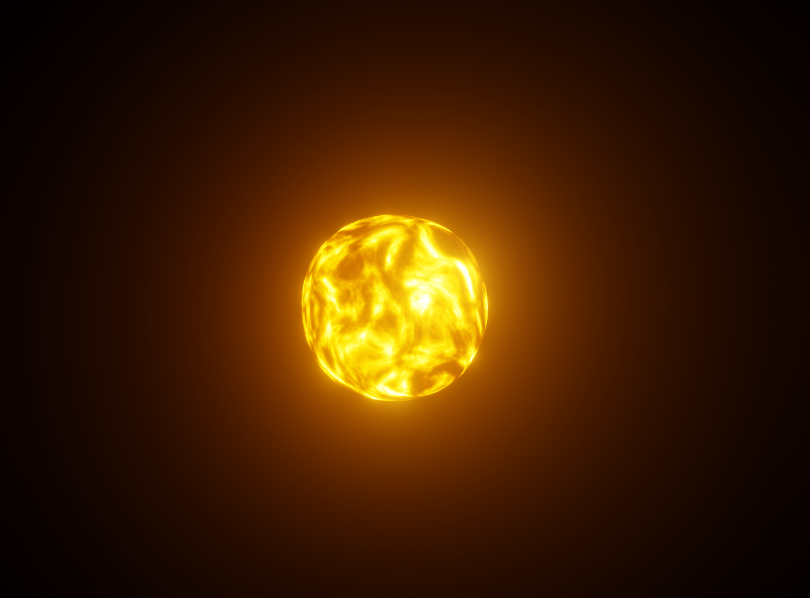
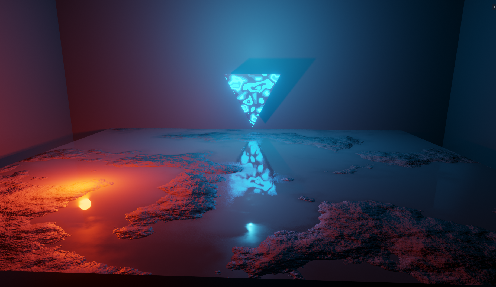

# Blender Portfolio

A collection of 3D modelling experiments and game assets created while
learning Blender, including character modelling, hard-surface modelling,
rigging, lighting and rendering.

## Featured Projects

### Bunny Player

Character model created as a stylised player character.

**Focus:** Character modelling, topology

---

### Sensei Kage

Character modelling experiment exploring humanoid proportions and clothing.

**Focus:** Character modelling

---

### Starter Car

Vehicle modelling exercise.

**Focus:** Hard-surface modelling, topology

---

### Red Enemy

Enemy character with an armature for animation.

**Focus:** Character modelling, rigging

---

### Energy Ball

Experiment with materials, emission and rendering.

**Focus:** Materials, lighting, rendering

---

### Lighting and Rendering Study

Experiment focused specifically on lighting, materials and rendered presentation.
